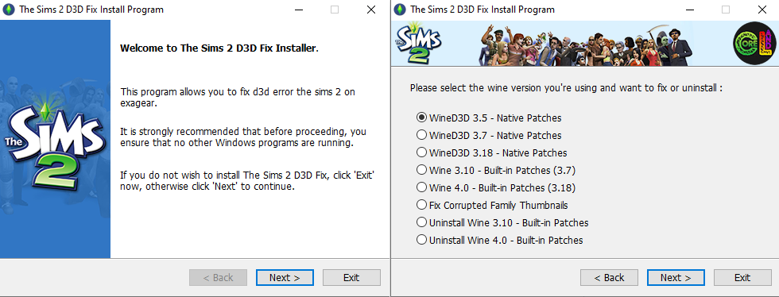

 

 
  
## The Sims 2 D3D Fix

<!-- PROJECT LOGO -->
 

  
  

## How to play The Sims 2 in Exagear?
Hi! Well actually these patches created by Wine Users and it took a lot of time and effort thus Thanks to swswine, Robert Walker, Alexandr Oleynikov, Paul Gofman, Luke Horwell and all others who tried to make it possible to run The Sims 2 under Wine. running the sims 2 on exagear was impossible and a big trouble btw after weeks I got it how to run so I applied and compiled these patches in exagear built-in. additionally I applied patches on WineD3D Dlls Native (thanks to Federico Dossena for his advice) it means The Sims 2 can be run on every Wine versions.
* Update 2023: DXVK implemented in Exagear and D3DFIX no longer needed unless you choose wined3d or your phone doesnt support dxvk (suitable for Mali gpu users)
### Whats the problem?
The Sims 2 crashes with Direct3D returned an error:
D3DERR_INVALIDCALL!. Why? here is your answer
Hardcoded 256 vertex shaders.
The Sims 2 requests 1024 vertex shader constants, but Wine has a hardcoded limit of 256. Direct3D 9 normally supports up to 8192, using hardware shaders first (where available), followed by software emulation. Software emulation is currently not supported in Wine.

### Requirements:
Wine: 3.10 - 4.0 (Built-in) - different versions e.g. 6.0, 7.1, etc (Native)
GPU: wine 3.10 (Turnip & VirtIO) - wine 4.0 (Turnip)
-Red Hat VirtIO not supported causes black screen and crashes immediately.

### What about Exagear? Nice Idea
I would always thinking it is really possible to apply that in exagear or not. After weeks I got it how to avoid this error so applied patches in builtin cache then game works perfect using these workarounds.

But remember this patches only work on The Sims 2, Ultimate Collection, Pet Stories and Castaway Stories other sims 2 game like Life Stories is not working currently (only renders black textures).
Note: Installing latest expansion for The Sims 2 base game is necessary

Installation, Compiling and Running TS2 on Exagear created by CoreLand Youtube Channel: https://www.youtube.com/@coreland2

## Credits and Third-party
[sims2-wine-patches](https://github.com/lah7/sims2-wine-patches)

[wined3d4win](https://github.com/adolfintel/wined3d4win)
